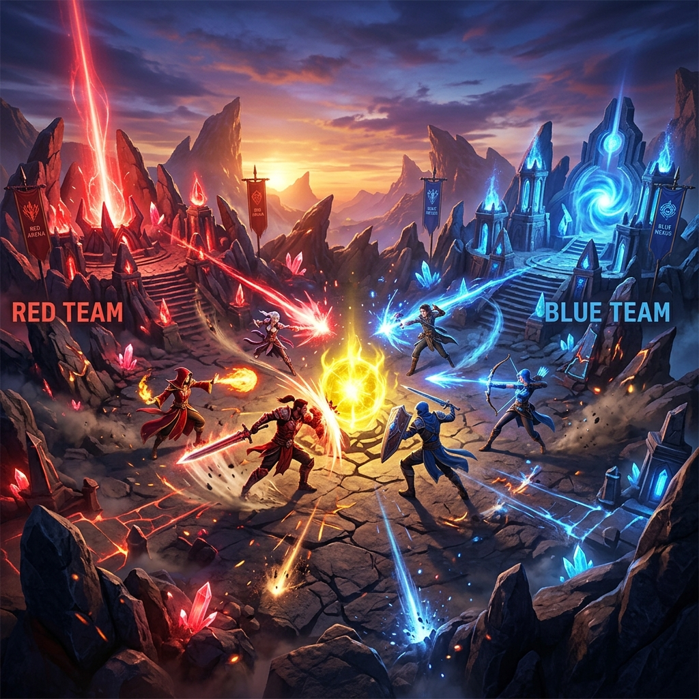
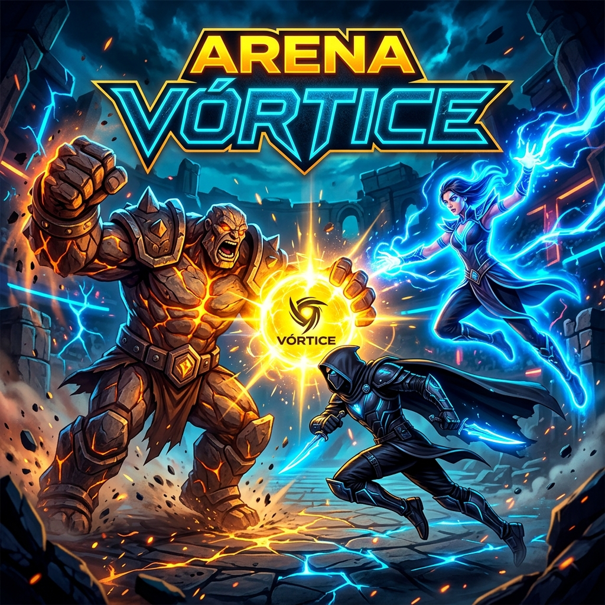
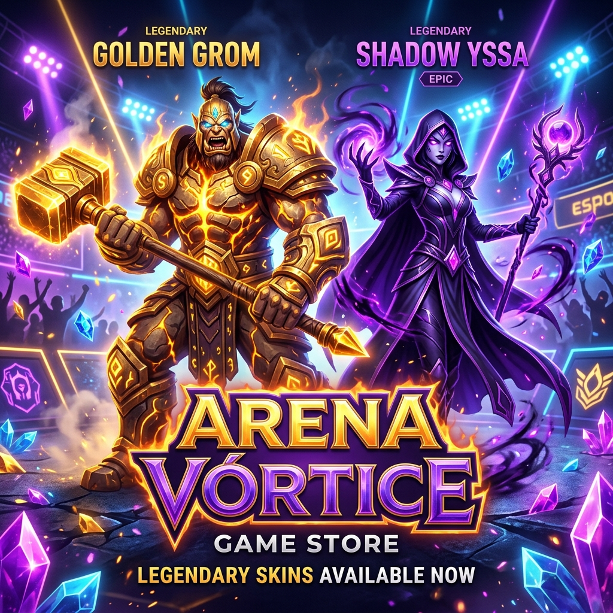
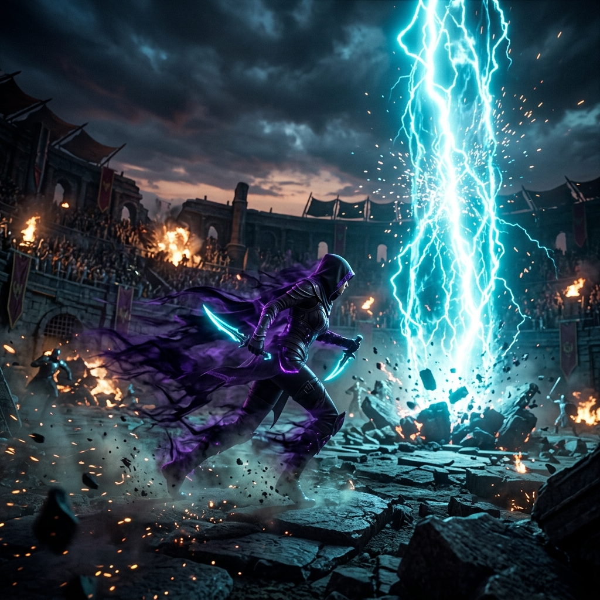

# <div align="center">

{width=100% style="border-radius:12px;margin-bottom:20px;"}

# ⚔️ **ARENA VÓRTICE** ⚔️
**3v3 Tactical Action Brawl — Roblox Edition**

[](https://www.roblox.com)
[](#-season-pass--temporada-1)
[](#-filosof%C3%ADa-de-monetizaci%C3%B3n)
[](#-arquitectura-t%C3%A9cnica)

<p align="center"><b>¡Lucha, captura el Núcleo Sagrado y asciende a la división Leyenda en el brawler 3v3 más dinámico de Roblox!</b></p>

<sub>Desarrollado con arquitectura escalable en Luau, física de partículas personalizada, simulación de cámara inmersiva y DataStore v1.2.</sub>

---

## ⚡ Novedades de la Versión 1.5 – Pulido Final

> **¡La versión 1.5 ya está disponible!** Esta actualización lleva el juego al nivel de pulido pre‑lanzamiento.

- **🟡 Hit‑Stop diferenciado por Súper Habilidad**
  - `HitStopManager` introduce **pausas de 2‑3 frames** y *screen‑shake* variables según el súper (Grom, Yssa, Kael, Pyra).
  - Comunicación cliente‑servidor vía `RemoteEvent HitStopEvent`.
- **🟡 Sonidos Únicos de Pyra**
  - Nuevos SFX de fuego para ataque básico y súper, con `PlaybackSpeed` aleatorio.
- **🟡 Anti‑Cheat WalkSpeed Server‑Side**
  - Detección de speed‑hacks, avisos y expulsiones automáticas.
- **🟠 Rewarded Video Ads (Roblox)**
  - Sistema de monetización no invasivo: recompensas diarias por ver videos.
- **🟡 Requisito de Tótem antes del Match**
  - `TotemGrabManager` obliga a recoger un tótem antes de poder iniciar la partida; notificaciones al cliente mediante `RemoteEvent RequireTotemPickup`.

---

## 🎮 Roster de Héroes

| Héroe | Rol | Ataque Básico | Súper Habilidad | VFX |
| :---: | :---: | :---: | :---: | :---: |
| <br>**Grom** | 🛡️ Tanque | Melee pesado *(20 dmg)* | **Onda Sísmica** – Knockback 15 studs + 40 dmg | Chispas de rocas, polvo y grietas en tierra |
| <br>**Yssa** | 🔮 Maga Control | Rayo místico *(15 dmg)* | **Tormenta Embotellada** – Área de rayos 3 s (48 dmg total) | Destello eléctrico y chispas azul neón |
| <br>**Kael** | 🗡️ Asesino | Dagas de sombra *(20 dmg)* | **Golpe Fantasma** – 1.5 s invisibilidad + daño doble (x2) | Aura púrpura y sombras |
| <br>**Pyra** | 🔥 Maga Fuego | Esfera de fuego *(15 dmg)* | **Infierno Vorticista** – Anillo de fuego 4 s (10 dps) | Llamas y chispas naranjas |

---

## 🛠️ Arquitectura Técnica & Servicios

- **DataStoreService** – Persistencia segura de XP, Monedas, Gemas, RP y skins.
- **MarketplaceService** – Validación de recibos en servidor.
- **RemoteEvents**
  - `GameEvents.HitStopEvent` – controla hit‑stop y screen‑shake.
  - `GameEvents.RequireTotemPickup` – indica si el jugador necesita el tótem.
- **RunService & Raycasting** – cámara top‑down con transparencia dinámica.
- **TweenService & Debris** – partículas, números flotantes de daño y screen‑shake.

### Nuevos Managers del Servidor
- `ServerScriptService/HitStopManager.lua` – gestiona hit‑stop y transmite intensidad de shake.
- `ServerScriptService/TotemGrabManager.lua` – verifica que cada jugador recoja el tótem antes de iniciar la partida.

---

## 🏆 Sistema de Liga & Rangos (Ranked 3v3)

Asciende de rango ganando partidas competitivas. El sistema calcula tus **RankPoints (RP)** automáticamente tras cada combate:
- **Victoria:** `+25 RP` + `50 XP` + `10 Monedas`
- **Derrota:** `-15 RP` + `25 XP` + `5 Monedas`

```
🥉 Bronce (0‑299 RP) → 🥈 Plata (300‑599 RP) → 🥇 Oro (600‑999 RP) → 💎 Diamante (1000‑1499 RP) → 👑 Leyenda (1500+ RP)
```

---

## 🎁 Season Pass — Temporada 1: *"Cristales del Vórtice"*

<div align="center">
  
</div>

- **Línea Gratuita:** Recompensas de Monedas (50🪙 → 500🪙) acumulando XP de batalla.
- **Línea Premium (150 💎):** Gemas adicionales y cosmético legendario **Kael Sombra de Cristal**.

---

## 💎 Filosofía de Monetización: 100 % No Pay‑To‑Win

> En *Arena Vórtice*, **el dinero no compra victorias**. Todos los cosméticos modifican solo la estética (colores, materiales) sin afectar vida, velocidad ni daño.

---

## 🗺️ Arenas de Combate

<div align="center">
  
</div>

1. 🏛️ **El Cráter Sagrado:** Plataforma central elevada con ruinas ancestrales y atardecer místico.
2. ⛏️ **Las Minas de Cristal:** Mina subterránea con desniveles, altares de captura y cristales bioluminiscentes.

---

## 📁 Estructura del Repositorio

```text
ArenaVortice/
├── ArenaVortice.rbxl                       # Proyecto principal de Roblox Studio
├── README.md                               # Documentación interactiva del repositorio
├── .agents/                                # Directivas y reglas de desarrollo con IA (AGENTS.md)
│   └── AGENTS.md
├── Doc_inicial/                            # Documentación de diseño inicial
│   ├── Vers. 1.0/                          # GDD y Plan Estratégico inicial
│   ├── Vers. 1.1/
│   └── Vers. 1.2/
├── Documentacion del Proyecto/             # Historial de cambios, estados y planes
│   └── Planes_Aprobados/
│       ├── Vers. 1.0/                      # Planes y Walkthroughs del MVP
│       ├── Vers. 1.1/                      # Game Feel, VFX y 4º Héroe Pyra
│       ├── Vers. 1.2/                      # 2º Mapa, Ranked 3v3 y Season Pass
│       └── Vers. 1.5/                      # Pulido Final – Hit‑Stop, Totem, Anti‑Cheat, Ads
├── Material_Marketing_Lanzamiento/          # Assets promocionales en alta resolución
│   ├── Icono_Juego.png                     # Ícono oficial (1:1)
│   ├── Miniatura_Juego.png                 # Thumbnail de portada (16:9)
│   ├── Banner_Tienda.png                   # Banner publicitario de la tienda
│   ├── Teaser_SuperHabilidades.png         # Teaser gráfico de habilidades
│   └── Marketing_Kit.md                    # Textos promocionales y hashtags SEO
├── ServerScriptService/
│   ├── AntiAFK.lua
│   ├── TotemGrabManager.lua                # Nuevo: gestión de tótem antes del match
│   ├── HitStopManager.lua                  # Nuevo: hit‑stop por súper habilidad
│   └── ...                                 # Otros scripts de servidor
```

---

## 💻 Desarrollo Local en Roblox Studio

1. **Clonar o descargar** este repositorio en tu equipo.
2. Abre `ArenaVortice.rbxl` con **Roblox Studio**.
3. Habilita el acceso a la API: `Game Settings ➔ Security ➔ Enable Studio Access to API Services`.
4. Presiona **Play (F5)** para simular el ciclo completo: `Lobby ➔ Selección de Héroe ➔ Combate ➔ Resultados & RP ➔ Return to Lobby`.

---

<div align="center">
  <b>Desarrollado con ❤️ para la comunidad de Roblox</b><br>
  © 2026 Arena Vórtice Team. Todos los derechos reservados.
</div>
